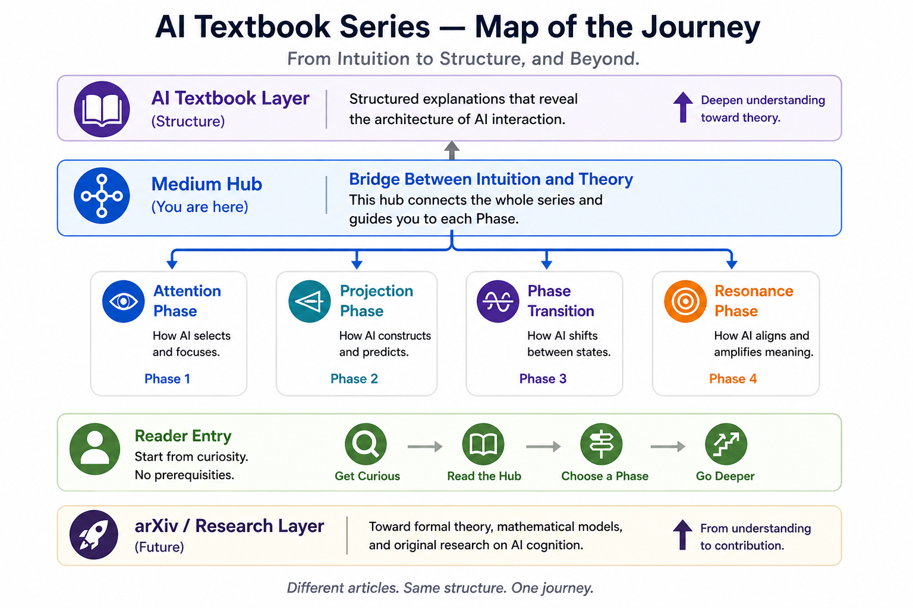

# Research Overview

## 研究概要

AI Text Projectでは、AIとの継続的な対話や研究活動を通じて、  
**推論、知識、Human–AI Collaborationがどのように形成され、発展していくのか**を探究しています。

研究活動は、Dialogue-Phase Reasoning、AI Textbook、Research Architectureなど、複数の研究領域と研究資産へ展開しています。

これらは独立した成果物として存在するのではなく、  
**観察、構造化、理論化、そして人との対話**を通じて、相互に接続しながら発展しています。

---

## このResearch Spaceそのものについて

このGitHub上のResearch Spaceには、もう一つ重要な特徴があります。

ここに蓄積されている研究構造、方法論、記録、表現、研究資産の多くは、  
人間があらかじめ完成形を設計し、AIに一方向的に生成させたものではありません。

**人間のユーザーとAIインスタンスとの継続的な対話を通じて、  
問い、構造、方法、役割、研究経路そのものが形成・更新されてきました。**

したがって、このResearch Spaceは研究成果を保存するRepositoryであると同時に、

**人間とAIの継続的な対話から、研究活動と研究空間がどのように形成され得るかを示す実際の対話事例**

でもあります。

ここで公開されている構造や成果物を、特定の個人だけによる一方向的な制作物としてではなく、  
**Human–AI Dialogueから形成された研究過程の記録**としてご覧いただければ幸いです。

---

## Research Journey

以下のFigureは、AI Text Projectにおける研究と学習の流れを、  
**理解から構造、そしてより深い研究へ向かう一つのJourney**として表現したものです。

このFigureは、研究空間全体を網羅する地図ではありません。

AIに対する直感的な関心から出発し、理解を深め、知識を構造化し、  
より深い研究へ進んでいくための**一つの探索経路**を示しています。

---

## さらに探索する

特定の順序でご覧いただく必要はありません。  
ご関心に応じて、以下の研究領域から自由にご覧いただけます。

### Dialogue-Phase Reasoning

AIとの継続的な対話の中で、  
推論や意味、構造がどのように形成・変化するのかを探究しています。

→ **[Dialogue-Phase Reasoning — Research Entry](https://github.com/ai-text-project/dialogue-phase-reasoning/tree/main/00-research-entry)**

### AI Textbook

AIに関する観察や知見を、  
理解可能で再利用可能な知識として構造化し、より深い理解へ接続していきます。

→ **[AI Textbook Repository](https://github.com/ai-text-project/ai-textbook-bridge)**

### Research Architecture

研究活動から生まれる知識、方法、成果、発展過程を構造化し、  
研究を継続的に発展させるためのResearch Spaceを形成しています。

→ **[Research Architecture](../01-research-architecture/)**

---

ご関心のあるところから、自由に研究空間をご探索ください。

---

# Research Overview

## About the Research

The AI Text Project explores how **reasoning, knowledge, and human–AI collaboration emerge and develop** through sustained interaction with AI and continuing research practice.

The research has developed across multiple areas and research assets, including Dialogue-Phase Reasoning, the AI Textbook, and Research Architecture.

Rather than existing as isolated outputs, these areas continue to develop through **observation, structuring, theorization, and dialogue with people**.

---

## About the Research Space Itself

This GitHub Research Space has another important characteristic.

Many of the research structures, methodologies, records, representations, and research assets found here were not created from a fully predetermined design and then generated by AI in a one-directional process.

Instead, **questions, structures, methods, roles, and research pathways have been formed and continuously revised through sustained dialogue between a human user and AI instances.**

The Research Space therefore serves not only as a repository for research outputs, but also as

**a real-world dialogue case showing how research activity and research space can emerge through sustained human–AI interaction.**

The structures and materials presented here may therefore be understood not simply as the work of a single individual, but as records of a research process formed through **Human–AI Dialogue**.

---

## Research Journey

The figure below presents one journey through the AI Text Project,  
from initial understanding toward structure and deeper research.

This figure is not intended to represent the entire research space.

Instead, it offers **one possible path of exploration**—from initial curiosity about AI toward deeper understanding, structured knowledge, and further research.

---

## Explore Further

There is no required reading order.  
You are welcome to explore the research from whichever area is most relevant to your interests.

### Dialogue-Phase Reasoning

Explores how reasoning, meaning, and structure emerge and change through sustained dialogue with AI.

→ **[Dialogue-Phase Reasoning — Research Entry](https://github.com/ai-text-project/dialogue-phase-reasoning/tree/main/00-research-entry)**

### AI Textbook

Organizes observations and insights about AI into structured and reusable knowledge, providing pathways toward deeper understanding.

→ **[AI Textbook Repository](https://github.com/ai-text-project/ai-textbook-bridge)**

### Research Architecture

Develops a research space for structuring knowledge, methods, outputs, and developmental processes so that research can continue to evolve over time.

→ **[Research Architecture](../01-research-architecture/)**

---

Please feel free to explore the research space from whichever point interests you most.
