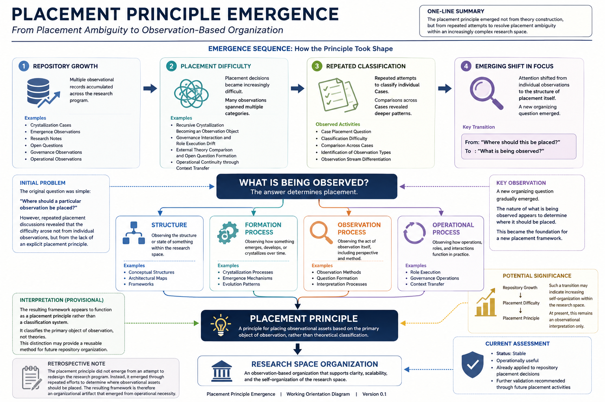

# Placement Principle Working Orientation Diagram

## Purpose

This note provides a visual representation of the emergence process that led to the formulation of the Placement Principle.

The purpose is not to establish a finalized theoretical model.

The purpose is to support orientation within the observation record by presenting the major structural transitions in a graphical form.

---

## Diagram



---

## Relationship to Other Documents

This document should be interpreted together with:

* 14 Placement Principle Emergence
* 15 Placement Principle Emergence (ASCII Representation)

The three documents serve different functions:

| Document                         | Function                          |
| -------------------------------- | --------------------------------- |
| 14 Placement Principle Emergence | Full observation record           |
| 15 ASCII Representation          | Compact structural representation |
| 16 Working Orientation Diagram   | Visual orientation aid            |

---

## Interpretation

The diagram illustrates a provisional interpretation of how the Placement Principle emerged from repeated placement difficulties within a growing research space.

The central transition may be summarized as:

```text
Where should this be placed?

↓

What is being observed?
```

The diagram suggests that placement decisions increasingly depended upon identifying the nature of the observation itself.

Observed dimensions include:

* Structure
* Formation Processes
* Observation Processes
* Operational Processes

The Placement Principle emerged as an organizational response to these distinctions.

---

## Status

Working Orientation Diagram

Visual interpretation only.

Further refinement may occur as the research space continues to evolve.

