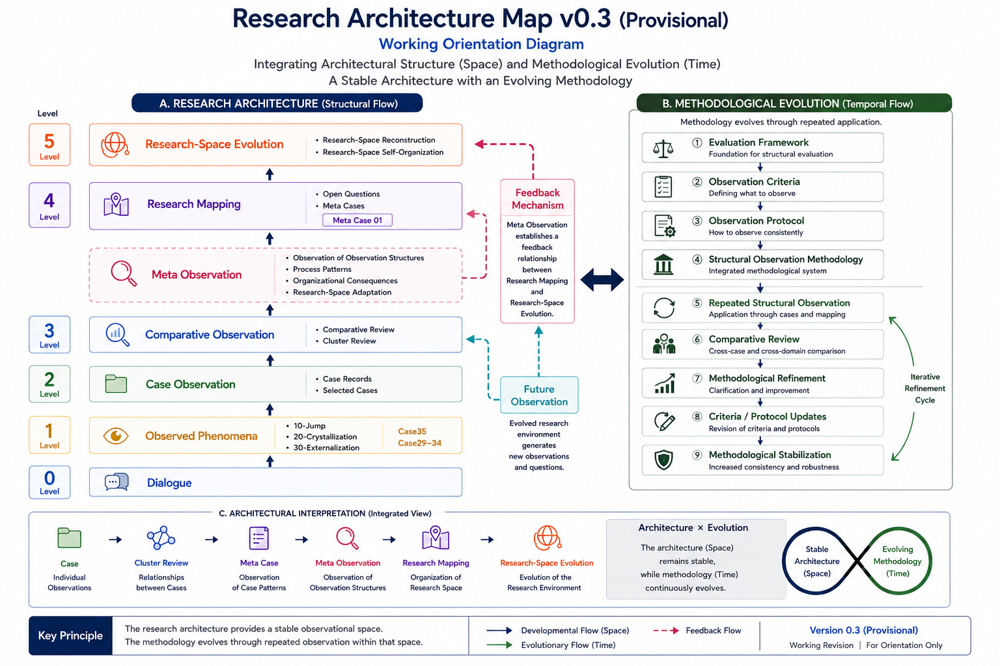

# Research Architecture Figures

This directory contains the primary visual representations of the Research Architecture layer.

These figures provide a high-level orientation to the Dialogue-Phase Reasoning research program by integrating both the structural organization of the research space and the current interpretation of methodological development.

The figures are intended as navigational and explanatory resources rather than finalized theoretical models.

---

# Current Architecture

## Research Architecture Map v0.3 (Provisional)

*Figure 1. Research Architecture Map v0.3 (Provisional). The diagram integrates the current structural organization of the research space with the provisional methodological evolution model.*

The current Research Architecture integrates two complementary perspectives.

### A. Research Architecture (Structural Perspective)

The left side summarizes the relatively stable organizational structure of the research program.

It illustrates the developmental relationship among:

- Dialogue
- Observed Phenomena
- Case Observation
- Comparative Observation
- Meta Observation
- Research Mapping
- Research-Space Evolution

This structure represents the current architectural organization of the research environment.

---

### B. Methodological Evolution (Temporal Perspective)

The right side summarizes the current interpretation of how the Structural Observation Methodology appears to evolve through repeated observation.

Current observations suggest a provisional developmental sequence from:

- Evaluation Framework
- Observation Criteria
- Observation Protocol
- Structural Observation Methodology

toward:

- Repeated Structural Observation
- Comparative Review
- Methodological Refinement
- Criteria / Protocol Updates
- Methodological Stabilization

This developmental interpretation remains provisional and is subject to continued observation.

---

## Architecture × Methodology

The current working interpretation distinguishes two complementary dimensions.

- **Research Architecture** represents the relatively stable structural organization (Space).
- **Methodological Evolution** represents the continuing refinement of observation methodology (Time).

Accordingly, the architecture itself is interpreted as comparatively stable, while the methodological layer continues to evolve through repeated structural observation.

The present figure integrates these two perspectives into a single working orientation diagram.

---

# Version History

| Version | Characteristics |
|---------|-----------------|
| **v0.1** | Initial architectural organization of the research space |
| **v0.2 (Draft)** | Introduced Meta Observation as a feedback mechanism |
| **v0.3 (Provisional)** | Integrates stable research architecture with methodological evolution |

The current version should be understood as a working interpretation rather than a finalized theoretical architecture.

---

# Related Documents

## Research Architecture

- [Research Architecture](../README.md)
- [Observation Layers](../01-observation-layers.md)
- [Case Lifecycle](../02-case-lifecycle.md)
- [Research-Space Evolution](../03-research-space-evolution.md)

## Research Space Topology

- Topology Evaluation Framework
- Topology Preservation Observation Criteria
- Topology Observation Protocol
- Structural Observation Methodology
- Methodological Evolution Model

Together these documents describe the methodological foundation represented in the right-hand side of the current architecture figure.

---

# Notes

The figures contained in this directory summarize the current architectural interpretation of the research program.

They are intended to support orientation, repository navigation, and conceptual understanding.

Architectural organization and methodological evolution should be interpreted as complementary rather than competing perspectives.

Future observations may refine the methodological interpretation while preserving the overall architectural structure.

Accordingly, the figures should be regarded as continuously evolving research assets rather than static documentation.

---

# Related Documents

For detailed explanations of the architecture:

* [Research Architecture](../README.md)
* [Observation Layers](../01-observation-layers.md)
* [Case Lifecycle](../02-case-lifecycle.md)
* [Research-Space Evolution](../03-research-space-evolution.md)

---

# Notes

Figures in this directory are maintained as navigational and explanatory resources supporting the Research Architecture layer.

They should be interpreted together with the accompanying architecture documents rather than as standalone theoretical statements.
