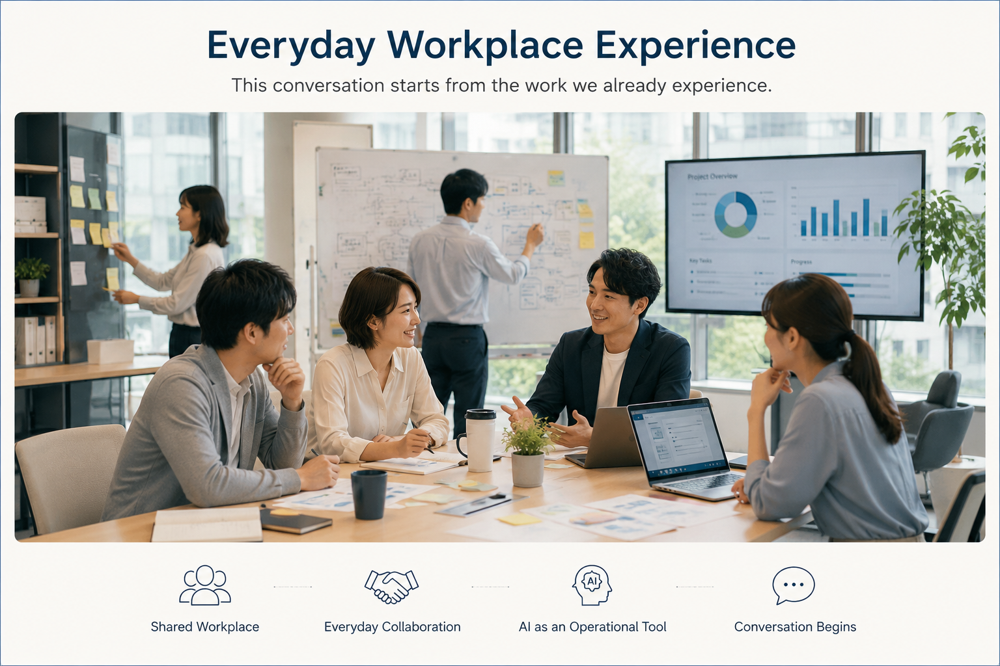

# Everyday Workplace Experience

## 日常の職場経験から始まる比較対話

私たちの比較対話は、

特別な研究テーマから始まるものではありません。

企業や研究者が日々の業務の中で経験している課題や工夫を共有することから始まります。

その経験を比較しながら、

新たな理解やHuman–AI Collaborationの可能性を共に考えていきます。

---

*Figure 1. Everyday Workplace Experience*

---

## このスライドの役割

このスライドは、Presentation全体の出発点です。

まず、企業の日常的な業務や協働環境を共有し、

その後の比較対話へ自然につながる入口として位置付けています。

---

## 次にご覧ください

→ **[01-operational-challenge](01-operational-challenge.md)**
