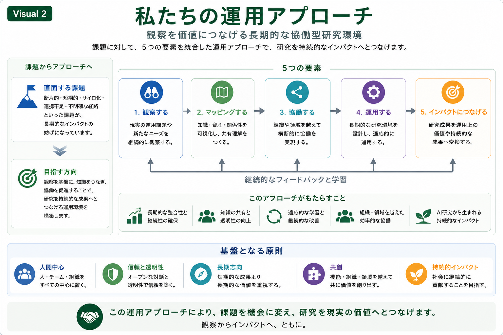

# Comparative Dialogue

## 私たちの運用アプローチ

本Research Programでは、運用上の課題を個別に解決することではなく、研究活動全体を継続的な協働環境として設計することを重視しています。

そのために、観察から価値創出までを一つの循環として捉え、継続的なHuman–AI Collaborationを支える運用アプローチを構築しています。

---

*Figure 2. 長期的なHuman–AI Collaborationを支える5つの運用要素。*

---

# 私たちの運用アプローチ

本Research Programでは、研究活動を次の5つの要素で構成しています。

1. **観察する**
   - 現場で起きている課題や新たなニーズを継続的に観察します。

2. **マッピングする**
   - 知識・研究資産・関係性を可視化し、共有理解を形成します。

3. **協働する**
   - 組織や専門分野を越えて比較対話を行い、新たな知見を共に創出します。

4. **運用する**
   - 長期的な研究環境として継続的に改善しながら運営します。

5. **インパクトにつなげる**
   - 研究成果を社会や組織の価値へと結び付け、持続的な成果へ発展させます。

---

# 継続的な循環

この5つの要素は、一方向に進む工程ではありません。

実践を通じて得られた学びや新たな観察は再び運用へ反映され、継続的なフィードバックと学習を通じて協働環境全体が発展していきます。

そのため、本Research Programでは、研究成果そのものだけでなく、研究を支える運営環境の継続的な改善も重要な対象と考えています。

---

# 比較対話の視点

このスライドでは、「私たちの方法」を提示することが目的ではありません。

むしろ、

企業の皆様が現在取り組まれている研究開発やAI活用と比較しながら、

- どのような運営上の工夫をされているか
- 継続的な協働をどのように実現されているか
- 長期的な価値創出に向けて、どのような課題を感じておられるか

について対話を始めるための共通基盤として位置付けています。

---

## 次にご覧ください

→ **[03-collaborative-outcomes](03-collaborative-outcomes.md)**
