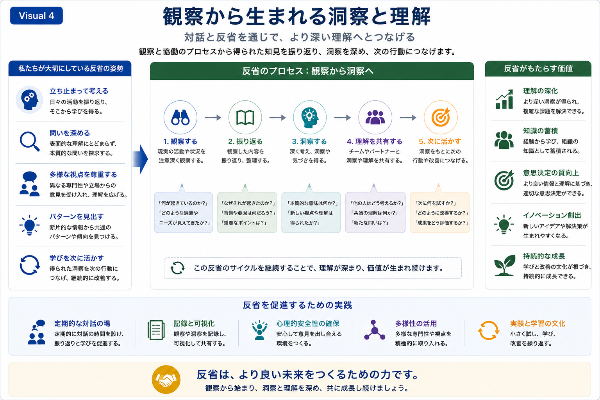

# Reflection and Insight

## 観察から生まれる洞察と理解

本Research Programでは、継続的な比較対話を支えるために、観察した事実を振り返り、洞察へと発展させるプロセスを大切にしています。

研究や実践を単に積み重ねるのではなく、対話と反省を繰り返すことで理解を深め、次の行動へつなげていくことを重視しています。

---

*Figure 5. 観察・振り返り・洞察を通じて理解を深め、継続的な改善につなげる反省サイクル。*

---

# ReflectionからInsightへ

本Research Programでは、次のような流れで理解を深めていきます。

1. **観察する**
   - 現場で起きている出来事や状況を丁寧に観察します。

2. **振り返る**
   - 観察した内容を整理し、背景や要因を考察します。

3. **洞察する**
   - 本質的な意味や新たな視点を見いだします。

4. **理解を共有する**
   - チームや対話相手と洞察を共有し、理解を広げます。

5. **次に活かす**
   - 得られた学びを実践へ反映し、新たな改善につなげます。

---

# 継続的な学び

この反省サイクルを繰り返すことで、

- 理解の深化
- 知識の蓄積
- より良い意思決定
- 新しいアイデアの創出
- 持続的な成長

が促進されます。

本Research Programでは、この継続的な学びの循環そのものを、長期的なHuman–AI Collaborationを支える重要な基盤と考えています。

---

# 比較対話の視点

本スライドでは、「私たちの振り返り方法」を説明することが目的ではありません。

企業の皆様と比較対話を行う中で、

- 日常的にどのような振り返りを行っているか
- 学びや洞察をどのように組織へ蓄積しているか
- 得られた知見を次の改善へどのようにつなげているか

について意見交換するための共通基盤として位置付けています。

---

## 次にご覧ください

→ **[05-collaboration-journey](05-collaboration-journey.md)**
