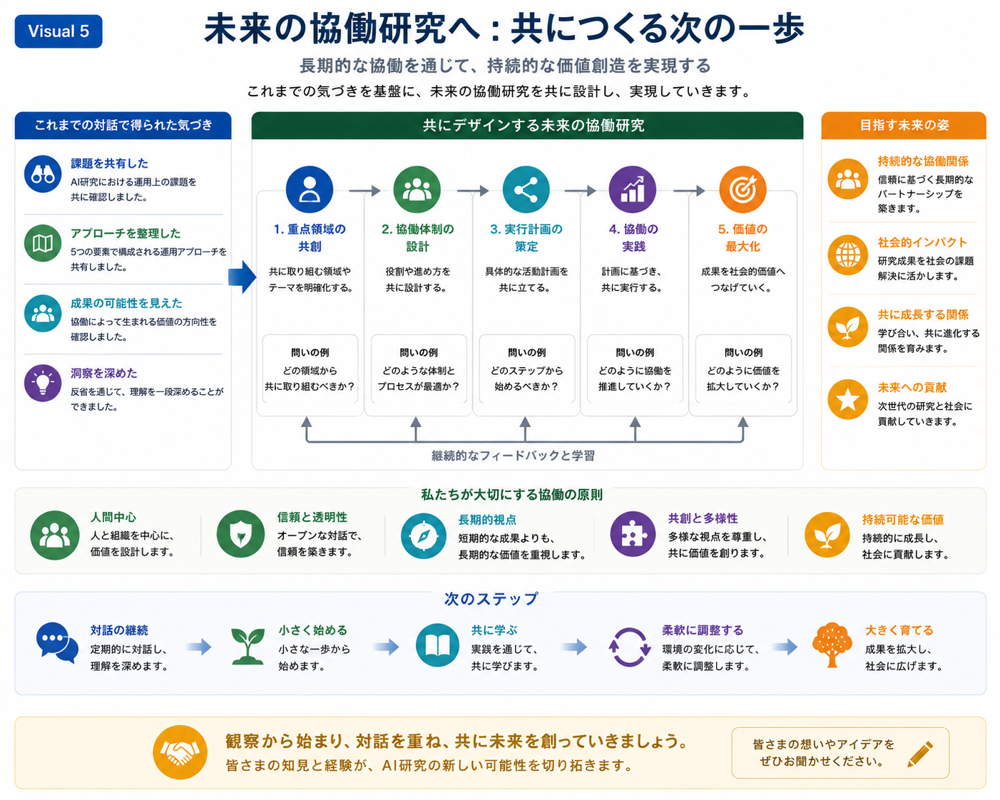

# 将来の共同研究

## 目的

このスライドは、これまでの比較対話を踏まえ、共通の理解から具体的な共同研究へと発展する段階を示しています。

対話を通じて得られた知見を基盤とし、長期的な協働を通じて、将来の研究をどのように構想し、設計し、実践していくことができるかを示しています。

本スライドは、あらかじめ決められた研究計画を提示することを目的としていません。

むしろ、双方が継続的な対話を通じて研究テーマや方向性を共に形成していく「共同探索」の考え方を重視しています。

---

## メッセージ

共同研究は、それぞれの視点を共有し、共通の関心を見出し、次の一歩を共に設計することから始まります。

長期的な協働は、研究成果の創出だけでなく、継続的な学習、社会への貢献、そして持続可能な価値の創造へと発展していきます。

---



*図5．将来の共同研究。共有された観察が、共同での企画・実践・継続的な学習・価値創造を通じて、長期的な共同研究へと発展していくプロセスを示しています。*

---

## 図の見方

左側では、これまでの比較対話を通じて得られた成果を整理しています。

参加者は、

- 共通する研究課題を共有し、
- 多様なアプローチを整理し、
- 協働の可能性を見出し、
- 対話と振り返りを通じて相互理解を深めてきました。

これらの共有された観察が、共同研究の出発点となります。

中央には、将来の協働を設計するための5つのステップを示しています。

1. 共通する研究テーマを見出す
2. 協働の枠組みを設計する
3. 初期の研究計画を作成する
4. 共同研究を実践する
5. 研究成果を学術的・社会的価値へと発展させる

各ステップには、あらかじめ決められた答えを示すのではなく、対話を促すための問いが添えられています。

また、継続的なフィードバックと学習を通じて、共同研究そのものも時間とともに発展していくことを表しています。

右側では、長期的な協働によって期待される将来像を示しています。

例えば、

- 持続可能な研究パートナーシップ
- 社会への貢献
- 相互の成長
- 将来の研究コミュニティへの貢献

などが挙げられます。

さらに、図の下部では、協働を支える基本原則として、

- 人を中心とした協働
- 信頼と透明性
- 長期的な視点
- 共創と多様性
- 持続可能な価値創造

を示しています。

最後に、本スライドは次のシンプルな発展プロセスで締めくくられます。

```text
対話

↓

小さく始める

↓

共に学ぶ

↓

継続的に適応する

↓

共に成長する
```

この流れは、真に価値ある共同研究は、一度に完成するものではなく、共有された経験を積み重ねながら段階的に育まれていくことを表しています。

---

## 次のスライドへ

共同研究の方向性が共有された後には、対話を通じて生まれた知見や研究成果を、一つの構造として整理・可視化することが重要になります。

次のスライドでは **Research Mapping（研究マッピング）** を紹介し、対話・研究資産・新たなアイデアをどのように結び付け、将来の共同研究を支える共通理解へと発展させていくかを示します。


-----


# Future Collaborative Research

## Purpose

This slide marks the transition from shared reflection to concrete collaborative research.

Building upon the insights gained through dialogue, it illustrates how future research can be designed, planned, and conducted together through long-term collaboration.

Rather than presenting a fixed research proposal, this slide emphasizes collaborative exploration, allowing both parties to shape future research directions together.

---

## Key Message

Collaborative research begins by sharing perspectives, identifying common interests, and jointly designing the next steps.

Long-term collaboration enables not only scientific progress but also continuous learning, social impact, and sustainable value creation.

---


*Figure 5. Future Collaborative Research illustrating how shared observations may gradually develop into long-term collaborative research through joint planning, execution, continuous learning, and value creation.*

---

## Reading the Figure

The left panel summarizes the outcomes of the preceding dialogue.

Participants have:

- Shared common research challenges
- Organized possible approaches
- Identified opportunities for collaboration
- Deepened mutual understanding through reflection

These shared observations provide the foundation for collaborative research.

The central framework illustrates a five-stage process for designing future collaboration.

1. Identify common research interests.
2. Design an effective collaboration framework.
3. Develop an initial research plan.
4. Conduct collaborative research activities.
5. Expand research outcomes into broader scientific and societal value.

Each stage is accompanied by guiding questions intended to stimulate discussion rather than prescribe predetermined answers.

Continuous feedback and learning support the entire process, allowing collaborative research to evolve over time.

The right panel highlights the long-term aspirations of collaboration.

These include:

- Sustainable research partnerships
- Societal impact
- Mutual growth
- Contribution to future research communities

The lower section summarizes the principles supporting successful collaboration, including:

- Human-centered collaboration
- Trust and transparency
- Long-term perspective
- Co-creation and diversity
- Sustainable value creation

Finally, the slide concludes with a practical progression:

Dialogue

↓

Start Small

↓

Learn Together

↓

Adapt Continuously

↓

Grow Together

This progression emphasizes that meaningful collaboration develops incrementally through shared experience.

---

## Transition

Once a common research direction has been established, the next challenge becomes organizing dispersed knowledge into a coherent structure.

The following slide introduces **Research Mapping**, demonstrating how dialogue, research assets, and emerging ideas can be connected into a shared understanding that supports future collaborative research.


