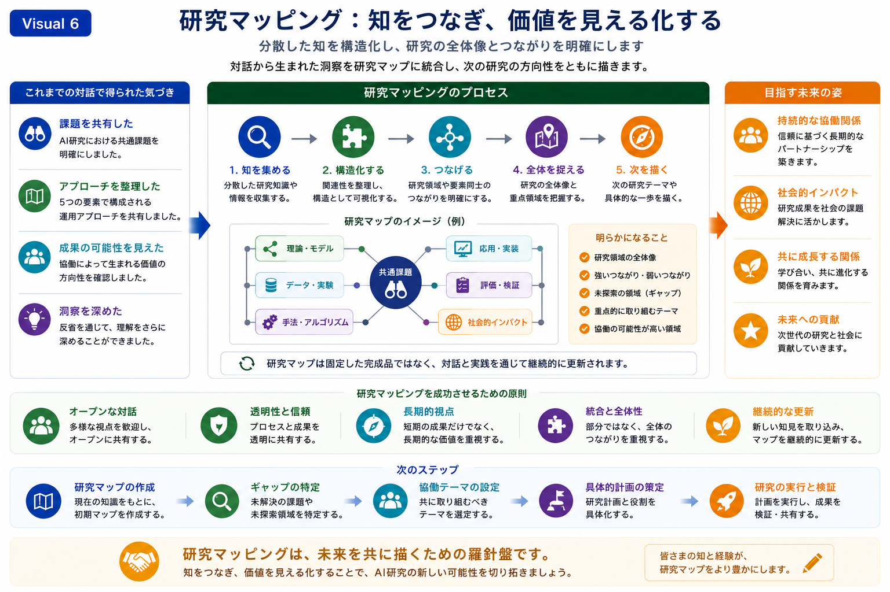

# Research Mapping（研究マッピング）

## 目的

このスライドでは、Research Mappingを、分散した知識を一つの研究全体像として整理・共有するための協働プロセスとして紹介します。

研究成果を個別のアウトプットとして扱うのではなく、対話・研究資産・新たなアイデアを相互に結び付け、将来の共同研究を支える共通の構造として整理する考え方を示しています。

Research Mappingは、研究機会の発見、分野横断的なつながりの強化、そして将来の研究方向を共に設計するための共通基盤を提供します。

---

## メッセージ

Research Mappingは、共有された観察を構造化された理解へと発展させます。

研究テーマ・研究方法・知識・将来の可能性の関係を可視化することで、共同研究はより明確で透明性が高く、長期的な継続性を持って発展していくことができます。

---



*図6．Research Mapping。分散した知識、研究資産、そして対話を一つの研究全体像として統合し、共同研究の企画、分野横断的な連携、将来の研究展開を支える構造を示しています。*

---

## 図の見方

左側では、これまでの対話を通じて形成された共通理解を整理しています。

参加者は、

- 共通する研究課題を共有し、
- 協働のためのアプローチを整理し、
- 将来の共同研究の可能性を見出し、
- 振り返りを通じて相互理解を深めてきました。

これらの共有された観察が、Research Mappingを構築する出発点となります。

中央では、Research Mappingを進めるための5つのステップを示しています。

1. 関連する知識や研究資源を収集する
2. それらの関係を整理し、一つの構造としてまとめる
3. 研究分野や新たなアイデアを相互につなぐ
4. 研究全体の構造を理解する
5. 将来の研究機会や発展の方向性を見出す

図中のResearch Mapは、理論・モデル・実験データ・アルゴリズム・応用事例・検証活動・社会的インパクトなど、多様な研究要素が共通する研究課題を中心として結び付けられる様子を例示しています。

Research Mapは完成された成果物ではなく、対話・共同研究・継続的な学習を通じて、絶えず更新・発展していく構造です。

右側では、Research Mappingによって見えてくる新たな視点を示しています。

例えば、

- 研究全体の俯瞰的な構造
- 強いつながりと弱いつながり
- 研究上の空白領域や未開拓の可能性
- 協働を優先すべき研究テーマ
- 高い協働可能性を持つ領域

などが挙げられます。

さらに、図の下部では、Research Mappingを支える基本原則として、

- 開かれた対話
- 透明性と信頼
- 長期的な視点
- 統合的・全体的な理解
- 継続的な改善

を示しています。

最後に、本スライドはResearch Mappingを活用した実践的な流れを示しています。

```text
Research Mapを作成する

↓

研究上の空白領域を見出す

↓

共同研究テーマを選定する

↓

具体的な研究計画を立案する

↓

共同研究と検証を進める
```

この流れは、Research Mappingが固定的な知識の整理ではなく、長期的な共同研究を支える発展的なフレームワークであることを示しています。

---

## 次のスライドへ

共通の研究全体像が形成されると、次に必要となるのは、参加者が継続的かつ効果的に協働するための運営基盤です。

次のスライドでは **Collaboration Framework** を紹介し、役割分担・対話・運営プロセス・実践プロトコルを通じて、持続可能な共同研究をどのように支えるかを示します。


---

# Research Mapping

## Purpose

This slide introduces Research Mapping as a collaborative process for organizing dispersed knowledge into a coherent research landscape.

Rather than treating research outputs as isolated results, it demonstrates how dialogue, research assets, and emerging ideas can be connected into a shared structure that supports future collaborative research.

Research Mapping provides a common reference point for identifying research opportunities, strengthening interdisciplinary connections, and designing future research directions together.

---

## Key Message

Research Mapping transforms shared observations into a structured understanding.

By visualizing relationships among research themes, methods, knowledge, and future opportunities, collaborative research can progress with greater clarity, transparency, and long-term continuity.

---


*Figure 6. Research Mapping illustrating how dispersed knowledge, research assets, and dialogue can be integrated into a shared research landscape that supports collaborative planning, interdisciplinary connections, and future research development.*

---

## Reading the Figure

The left panel summarizes the common understanding established through the preceding dialogue.

Participants have:

- Shared common research challenges
- Organized collaborative approaches
- Identified opportunities for future collaboration
- Deepened mutual understanding through reflection

These shared observations become the starting point for constructing a collaborative research map.

The central framework illustrates a five-stage Research Mapping process.

1. Collect relevant knowledge and research resources.
2. Organize relationships into a coherent structure.
3. Connect research domains and emerging ideas.
4. Understand the overall research landscape.
5. Identify future research opportunities and directions.

The example research map demonstrates how diverse research components—including theories, models, experimental data, algorithms, applications, validation activities, and societal impact—can be connected around shared research challenges.

Rather than representing a fixed artifact, the research map is continuously refined through dialogue, collaborative research, and ongoing learning.

The right panel highlights the insights that become visible through Research Mapping.

These include:

- The overall research landscape
- Strong and weak research connections
- Research gaps and unexplored opportunities
- Priority themes for collaboration
- Areas with high collaborative potential

The lower section summarizes the principles supporting successful Research Mapping.

These include:

- Open dialogue
- Transparency and trust
- Long-term perspective
- Integration and holistic understanding
- Continuous refinement

Finally, the slide concludes with a practical sequence for applying Research Mapping:

Create the initial research map

↓

Identify research gaps

↓

Select collaborative themes

↓

Develop concrete research plans

↓

Conduct collaborative research and validation

This progression emphasizes that Research Mapping serves as an evolving framework for supporting long-term collaborative research rather than producing a static representation of knowledge.

---

## Transition

Once a shared research landscape has been established, effective collaboration requires an operational framework that enables participants to work together efficiently.

The following slide introduces the **Collaboration Framework**, demonstrating how roles, processes, dialogue, and operational protocols can support sustainable collaborative research.
