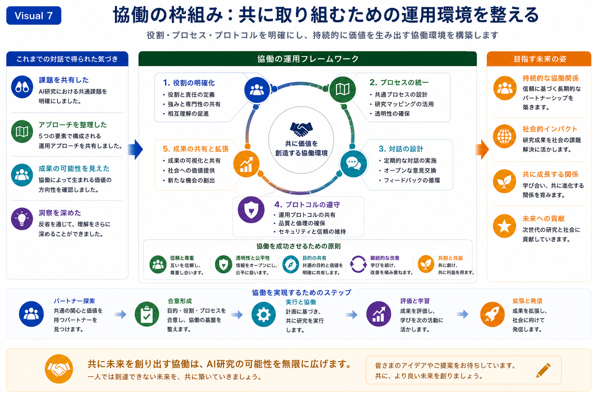

# Collaboration Framework（協働フレームワーク）

## 目的

このスライドでは、長期的な共同研究を、構造的・透明性・持続可能性を備えた形で推進するための **Collaboration Framework** を紹介します。

Research Mappingによって形成された共通理解を基盤とし、明確な役割分担、運営プロセス、継続的な対話、そして共通の運営プロトコルが、共同研究を継続的に発展させる環境をどのように支えるかを示しています。

本フレームワークは、特定の組織形態を規定するものではありません。

研究グループ、大学、企業、あるいは多様な共同研究プロジェクトに応じて柔軟に適用できる、共通の運営原則を提供することを目的としています。

---

## メッセージ

優れた共同研究は、共通の研究テーマだけで成立するものではありません。

長期的な協働を支えるためには、共通の役割、透明性の高い運営プロセス、継続的な対話、そして共有された運営プロトコルによって、研究環境そのものを共に構築していくことが重要です。

このような運営基盤があることで、新たな発見や研究機会に柔軟に対応しながら、持続可能な共同研究を発展させることができます。

---



*図7．Collaboration Framework。明確な役割分担、協働プロセス、継続的な対話、運営プロトコル、そして成果の共有が、持続可能な長期共同研究をどのように支えるかを示しています。*

---

## 図の見方

左側では、これまでの対話を通じて形成された共通理解を整理しています。

参加者は、

- 共通する研究課題を共有し、
- 協働のアプローチを整理し、
- 将来の研究機会を見出し、
- 振り返りを通じて相互理解を深めてきました。

これらの共有された観察が、共同研究を運営するための土台となります。

中央では、協働を支える5つの運営要素を示しています。

1. 役割と責任を明確にする
2. 共通の運営プロセスを整備する
3. 継続的な対話とフィードバックを設計する
4. 運営プロトコルを共有し、研究品質を維持する
5. 共同研究の成果を発展・共有する

これら5つの要素は相互に連携しながら循環し、安定性と柔軟性を兼ね備えた共同研究を支える運営サイクルを形成します。

図の下部では、協働を支える基本原則として、

- 信頼と相互尊重
- 透明性と公平性
- 共通の目的
- 継続的な改善
- 共創と相互利益

を示しています。

さらに、実践的な協働の流れとして、次のプロセスを示しています。

```text
適切な研究パートナーを見出す

↓

共通理解を形成する

↓

共同研究を実践する

↓

評価し、共に学ぶ

↓

研究成果をさらに発展させる
```

この流れは、持続可能な共同研究は、一度限りの研究活動ではなく、継続的な運営と対話を積み重ねることで育まれていくことを示しています。

右側では、Collaboration Frameworkによって実現を目指す長期的な将来像を示しています。

例えば、

- 持続可能な研究パートナーシップ
- 社会への貢献
- 相互の成長
- 将来の研究コミュニティへの貢献

などが挙げられます。

---

## 次のスライドへ

共同研究を支える運営基盤が整うと、その先には、知識創造を長期的に支える、より広い研究エコシステムが見えてきます。

次のスライドでは **AI Research Ecosystem** を紹介し、共同研究・知識共有・継続的な学習が、学術的・社会的価値を生み出す研究ネットワークへとどのようにつながっていくかを示します。


ーーー


# Collaboration Framework

## Purpose

This slide introduces the Collaboration Framework that enables long-term collaborative research to progress in a structured, transparent, and sustainable manner.

Building upon the shared understanding established through Research Mapping, it illustrates how clearly defined roles, operational processes, dialogue, and shared protocols create an environment where collaborative research can continuously evolve.

Rather than prescribing a rigid organizational model, the framework provides common operational principles that can be adapted to different research groups, institutions, and collaborative projects.

---

## Key Message

Successful collaborative research depends not only on shared scientific interests, but also on a shared operational environment.

By establishing common roles, transparent processes, continuous dialogue, and agreed operational protocols, research partnerships can sustain long-term collaboration while remaining adaptable to new discoveries and emerging opportunities.

---


*Figure 7. Collaboration Framework illustrating how clearly defined roles, collaborative processes, continuous dialogue, operational protocols, and shared dissemination support sustainable long-term collaborative research.*

---

## Reading the Figure

The left panel summarizes the common understanding established through previous dialogue.

Participants have:

- Shared common research challenges
- Organized collaborative approaches
- Identified future research opportunities
- Deepened mutual understanding through reflection

These shared observations provide the foundation for collaborative operation.

The central framework illustrates five complementary operational elements.

1. Clarify collaborative roles and responsibilities.
2. Establish common operational processes.
3. Design continuous dialogue and feedback.
4. Share operational protocols and maintain research quality.
5. Expand and disseminate collaborative outcomes.

These elements form a continuous operational cycle that supports stable and adaptive collaborative research.

The lower section summarizes the principles supporting successful collaboration.

These include:

- Trust and mutual respect
- Transparency and fairness
- Shared purpose
- Continuous improvement
- Co-creation and mutual benefit

The practical operational sequence illustrates how collaboration develops over time.

Identify appropriate research partners

↓

Build shared understanding

↓

Conduct collaborative research

↓

Evaluate and learn

↓

Expand research outcomes

This progression emphasizes that sustainable collaboration emerges through continuous operation rather than isolated research activities.

The right panel presents the long-term aspirations supported by the Collaboration Framework.

These include:

- Sustainable research partnerships
- Societal impact
- Mutual growth
- Contribution to future research communities

---

## Transition

Once collaborative research is supported by a stable operational framework, attention naturally shifts toward the broader research ecosystem that can sustain long-term knowledge creation.

The following slide introduces the **AI Research Ecosystem**, illustrating how collaborative research, shared knowledge, and continuous learning can contribute to an expanding network of scientific and societal value.
