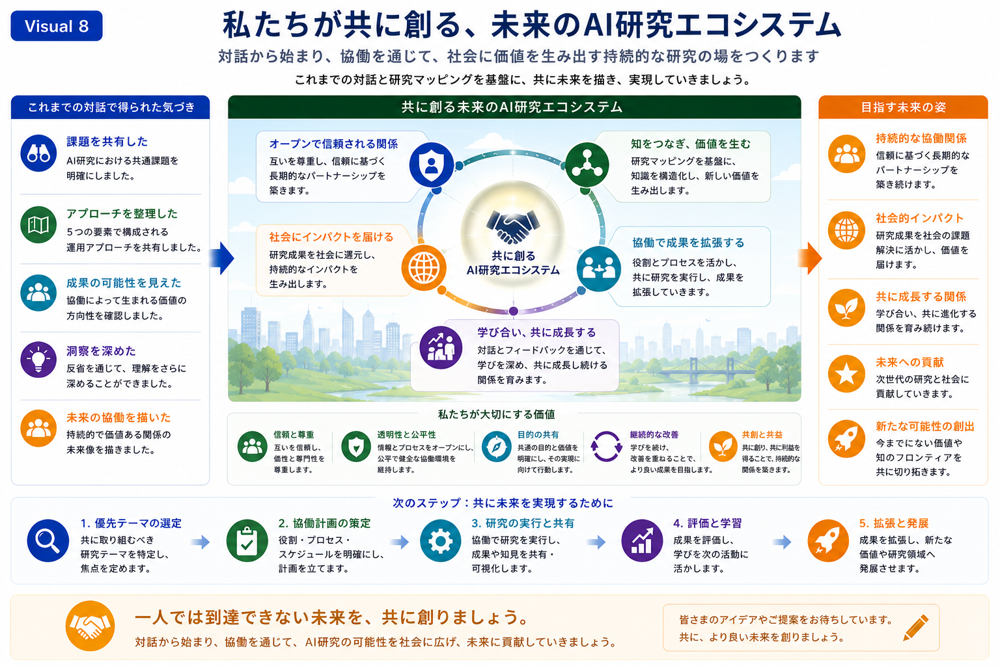

# AI Research Ecosystem

## 目的

本スライドは、これまでの対話・研究マッピング・協働フレームワークを統合し、長期的な協働を通じて形成されるAI研究エコシステムの全体像を示します。

個別の研究成果だけでなく、継続的な対話、知識の共有、共同研究、社会への価値創出が循環する研究環境を描くことで、持続可能な協働研究の将来像を共有することを目的としています。

---

## このスライドが伝えたいこと

AI研究の価値は、単独の成果だけではなく、人と人、研究と社会、知識と実践を継続的につなぐ研究エコシステムの中で最大化されます。

対話から始まる協働は、新たな知識を生み出し、研究成果を社会へ還元しながら、次世代へと受け継がれる持続可能な研究基盤へ発展していきます。

---

*Figure 8. AI Research Ecosystem illustrating how continuous dialogue, collaborative research, shared knowledge, and societal contribution together form a sustainable research ecosystem.*

---

## 図の読み方

左側には、これまでの対話を通じて得られた共通理解が整理されています。

参加者は、

- 共通課題を共有し
- 運用アプローチを整理し
- 協働の可能性を確認し
- 対話を通じて理解を深め
- 将来の協働研究の方向性を描いてきました。

これらの成果が、本スライドで示すAI研究エコシステムの出発点となります。

中央には、持続的なAI研究エコシステムを構成する5つの要素が示されています。

1. オープンで信頼される関係を築く
2. 知をつなぎ、新たな価値を創出する
3. 協働によって研究成果を拡張する
4. 学び合い、ともに成長する
5. 社会へ価値を届ける

これらは一方向の流れではなく、継続的に循環しながら研究コミュニティ全体を発展させていく仕組みとして設計されています。

右側には、このような協働によって実現を目指す将来像が整理されています。

- 持続的な協働関係
- 社会的インパクト
- 共に成長する研究コミュニティ
- 次世代への貢献
- 新たな研究可能性の創出

下部には、AI研究エコシステムを支える基本的な価値観が示されています。

- 信頼と尊重
- 透明性と公平性
- 目的の共有
- 継続的な改善
- 共創と共益

さらに、その下には、実践へ向けた基本的なステップが整理されています。

研究テーマの選定

↓

協働計画の策定

↓

共同研究の実施・共有

↓

評価と学習

↓

成果の拡張と発展

この流れは、一度限りの共同研究ではなく、継続的な研究活動を支える発展プロセスを示しています。

---

## まとめ

AI研究エコシステムは、一つの完成形ではありません。

対話を通じて新たな知見を取り込み、研究マッピングによって知識を整理し、協働フレームワークによって共同研究を支えながら、継続的に成長していく研究環境そのものです。

本Presentationで紹介した各Visualは、このエコシステムを構成する一つひとつの要素を示しています。

今後も、多様な研究者・研究機関との対話を重ねながら、新たな知識と価値を共創する研究コミュニティを育てていくことを目指しています。

## 次もご参考にご覧ください

→ **[09-visual-language-design](09-visual-language-design.md)**

ーーー

# AI Research Ecosystem

## Purpose

This slide integrates the preceding dialogue, Research Mapping, and Collaboration Framework into a unified vision of a sustainable AI Research Ecosystem.

Rather than focusing solely on individual research outcomes, it illustrates how continuous dialogue, shared knowledge, collaborative research, and societal contribution together create an environment where long-term research can continuously evolve.

The objective is to present a future-oriented research ecosystem in which collaborative knowledge creation becomes an ongoing process rather than a series of isolated projects.

---

## Key Message

The value of AI research is maximized not only through individual scientific achievements, but through a sustainable ecosystem that continuously connects researchers, knowledge, society, and collaborative practice.

Dialogue initiates collaboration, collaboration generates knowledge, knowledge creates societal value, and these experiences collectively contribute to the long-term growth of the research community.

---

*Figure 8. AI Research Ecosystem illustrating how continuous dialogue, collaborative research, shared knowledge, and societal contribution together form a sustainable research ecosystem.*

---

## Reading the Figure

The left panel summarizes the shared understanding established through the previous dialogue.

Participants have:

- Shared common research challenges
- Organized collaborative approaches
- Identified opportunities for future collaboration
- Deepened mutual understanding through reflection
- Envisioned future collaborative research

These shared observations provide the foundation for the AI Research Ecosystem presented in this slide.

The central framework illustrates five complementary elements that support a sustainable research ecosystem.

1. Build open and trusted relationships.
2. Connect knowledge and create new value.
3. Expand research outcomes through collaboration.
4. Learn and grow together.
5. Deliver societal impact.

Rather than representing a linear process, these elements continuously reinforce one another, enabling the research community to evolve over time.

The right panel presents the long-term vision supported by this ecosystem.

These include:

- Sustainable collaborative partnerships
- Societal impact
- Mutual growth within the research community
- Contributions to future generations
- Creation of new research opportunities

The lower section summarizes the core values that support this ecosystem.

These include:

- Trust and mutual respect
- Transparency and fairness
- Shared purpose
- Continuous improvement
- Co-creation and mutual benefit

Finally, the practical progression presented at the bottom illustrates how collaborative research can evolve in practice.

Select priority research themes

↓

Develop collaborative research plans

↓

Conduct and share collaborative research

↓

Evaluate and learn

↓

Expand research outcomes and future opportunities

This progression demonstrates that the AI Research Ecosystem is not a fixed destination, but an evolving environment that continuously supports collaborative research.

---

## Conclusion

The AI Research Ecosystem is not a finished structure.

It continuously evolves through dialogue, Research Mapping, collaborative practice, and shared learning.

Each Visual presented throughout this Presentation represents one component of this evolving ecosystem.

By strengthening collaboration among researchers, research institutions, and society, the ecosystem provides a foundation for creating new knowledge, generating long-term value, and expanding the future possibilities of AI research.
