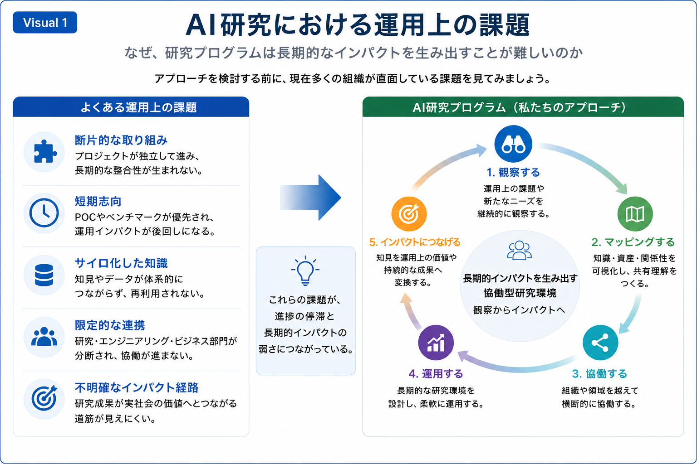

# Operational Challenge

## AI研究における運用上の課題

多くのAI研究やDXプロジェクトでは、高い技術力や優れた個別成果が生まれる一方で、それらを長期的な価値へと結び付ける運営面には多くの課題が残されています。

本Research Programでは、まず現在多くの組織が直面している運用上の課題を共有することから比較対話を始めます。

---

*Figure 2. AI研究における運用上の課題と、本Research Programが提案する協働型研究環境の概要。*

---

# 多くの組織で見られる運用上の課題

AI研究や研究開発では、次のような課題が見られます。

- プロジェクトが個別最適化され、継続的な知識形成につながりにくい
- PoCや短期成果が優先され、長期的な運用改善へ発展しにくい
- 知識や経験が組織内で分散し、再利用されにくい
- 部門間の協働が限定され、横断的な学習が進みにくい
- 研究成果が社会的価値へつながる道筋が見えにくい

これらは個別の問題ではなく、多くの組織で共通して見られる運営上の課題です。

---

# 本Research Programの考え方

私たちは、これらの課題を個別に解決するのではなく、

研究活動全体を一つの継続的な協働環境として捉えることを重視しています。

そのために、

1. 観察する
2. マッピングする
3. 協働する
4. 運用する
5. インパクトにつなげる

という循環を通じて、長期的なHuman–AI Collaborationを支える研究環境を構築しています。

---

# 比較対話の出発点

このスライドは、

「私たちの方法が正しい」

ことを示すものではありません。

企業の皆様が日常の業務や研究活動の中で感じている課題と比較しながら、

- 共通する点
- 異なる点
- 改善の可能性

について対話を始めるための出発点として位置付けています。

---

## 次にご覧ください

→ **02-comparative-dialogue.md**
