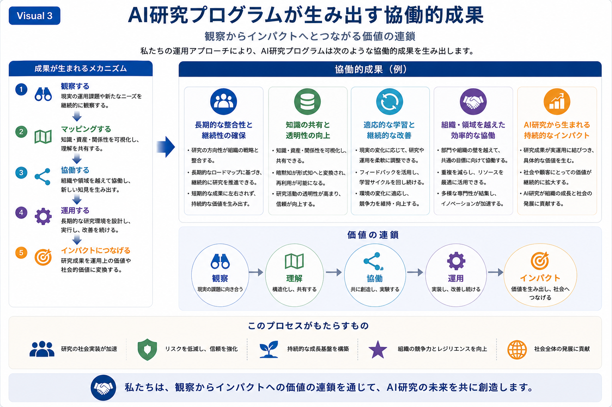

# Shared Knowledge and Collaborative Outcomes

## AI研究プログラムが生み出す協働的成果

本Research Programでは、観察から価値創出までを継続的な循環として運営することで、研究成果だけでなく、組織や社会における協働的な成果の形成を目指しています。

本スライドでは、運用アプローチを通じて生み出される代表的な成果と、それらが価値として連鎖していく考え方をご紹介します。

---

*Figure 4. 運用アプローチから生まれる協働的成果と価値の連鎖。*

---

# 協働によって生まれる成果

継続的な比較対話と協働を通じて、次のような成果が期待されます。

- 長期的な整合性と継続性の確保
- 知識の共有と透明性の向上
- 適応的な学習と継続的な改善
- 組織・領域を越えた効率的な協働
- AI研究から生まれる持続的なインパクト

これらは個別の成果ではなく、互いに支え合いながら発展する協働環境全体の成果として位置付けています。

---

# 価値の連鎖

本Research Programでは、

- 観察
- 理解
- 協働
- 運用
- インパクト

という一連の流れを、価値が連鎖的に形成されるプロセスとして捉えています。

それぞれの段階で得られた知見は、継続的な比較対話を通じて次の活動へとつながり、新たな価値を生み出していきます。

---

# 比較対話の視点

本スライドでは、「私たちの成果」を示すことが目的ではありません。

企業の皆様が日頃の研究開発やAI活用を振り返りながら、

- どのような成果が継続的に生まれているか
- 知識共有や協働はどのように行われているか
- 長期的な価値創出へどのようにつながっているか

を比較し、意見交換するための共通基盤として位置付けています。

---

## 次にご覧ください

→ **04-collaborative-practice.md**
