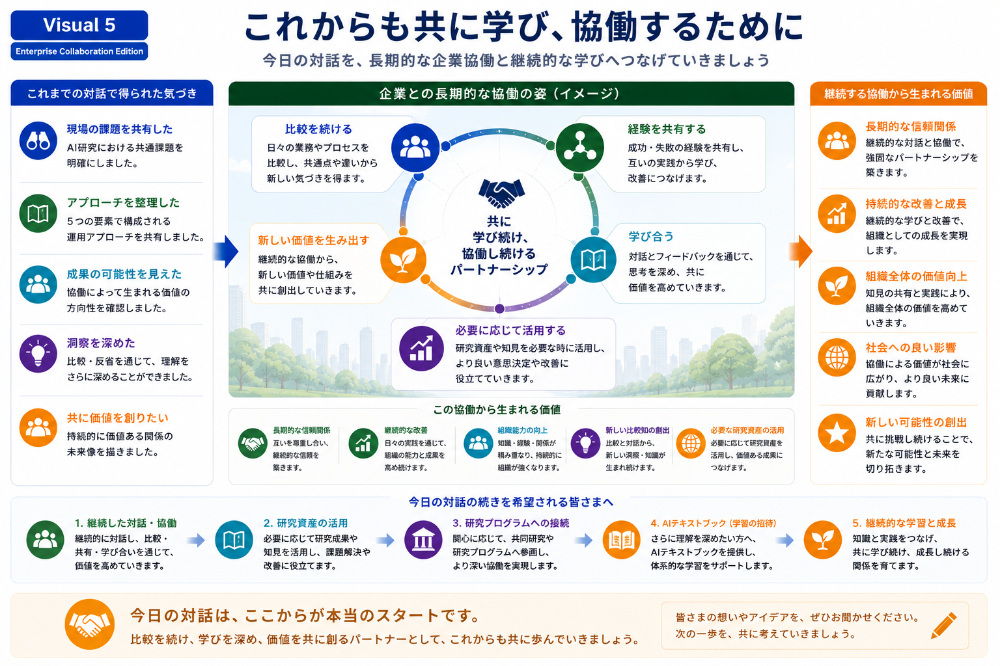

# Collaboration Journey

## これからも共に学び、協働するために

本Research Programでは、Presentationを研究成果の説明として終えるのではなく、継続的な比較対話と協働の出発点として位置付けています。

今日の対話をきっかけとして、企業と研究者が共に学び、経験を共有し、新たな価値を創造していく長期的なパートナーシップを目指しています。

---

*Figure 6. 比較対話から長期的な企業協働へ発展していく協働ジャーニー。*

---

# 協働は今日から始まります

Presentationを通じて、

- 共通する課題
- 私たちの運用アプローチ
- 協働によって生まれる成果
- 継続的な学び

をご紹介してきました。

ここでPresentationは終わりますが、私たちが目指している協働は、ここから始まります。

---

# 長期的な協働のイメージ

私たちは、企業との協働を次のような循環として考えています。

- 比較を続ける
- 経験を共有する
- 共に学び合う
- 必要に応じて研究資産を活用する
- 新しい価値を共に創り出す

この循環を繰り返すことで、一度限りの情報交換ではなく、継続的に成長し続ける協働関係を築いていくことを目指しています。

---

# 私たちが大切にしていること

継続的な協働を通じて、

- 長期的な信頼関係
- 継続的な改善
- 組織能力の向上
- 新しい比較知の創出
- 社会への価値創出

が生まれていくと考えています。

そのため、本Research Programでは、短期的な成果だけでなく、長期的な学びと価値創出を重視しています。

---

# 比較対話へのご案内

本Presentationをご覧いただき、ありがとうございました。

もしご関心をお持ちいただけましたら、

ぜひ皆様の現場での経験や課題についてお聞かせください。

比較対話を通じて、

- 共通点
- 相違点
- 新たな可能性

を共に探りながら、長期的な協働の第一歩をご一緒できれば幸いです。

---

## この先へ

Presentationはここで一区切りとなります。

より詳しくResearch Programをご覧いただく場合は、

- Research Assets
- Research Architecture
- Development History

などの関連資料もぜひご参照ください。
