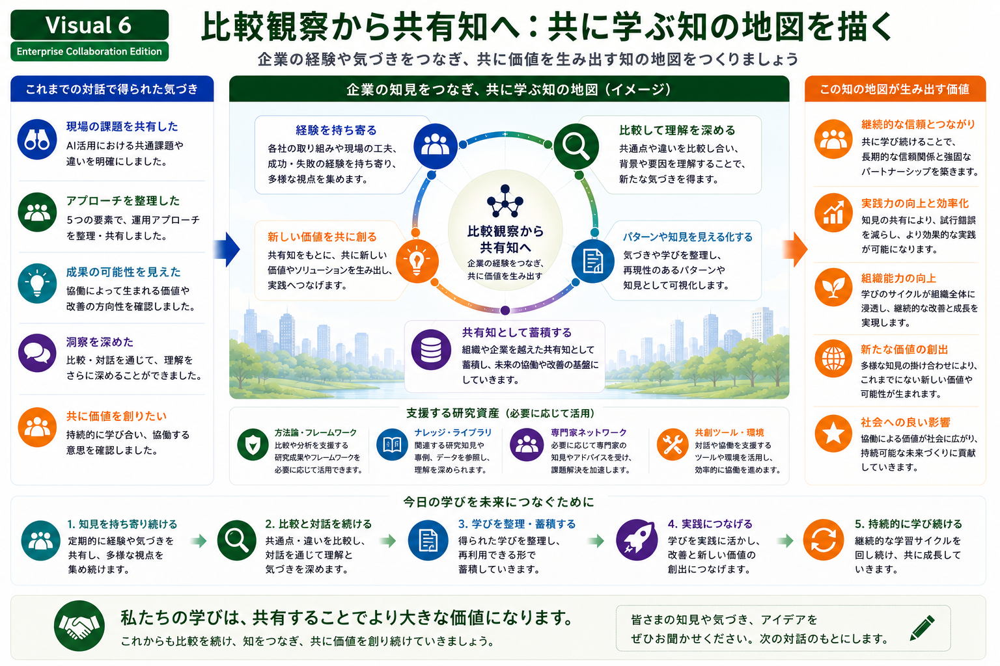

# Shared Knowledge Ecosystem

## 比較観察から共有知へ

企業との比較対話を継続していくためには、経験や知見を共有し、必要なときに活用できる形で整理していくことが重要です。

本Research Programでは、そのための研究資産や運用環境を整備しています。

---

*Figure 6. 比較観察を共有知へ発展させる知識循環と、それを支える研究資産。*

---

# 比較観察から共有知へ

企業との比較対話では、さまざまな経験や実践知が共有されます。

本Research Programでは、それらを

- 経験を持ち寄る
- 比較して理解を深める
- パターンや知見を可視化する
- 共有知として蓄積する
- 新たな価値を共創する

という循環の中で整理し、将来の協働へ活用していきます。

---

# 研究資産の役割

この循環を支えるために、必要に応じて研究資産を活用します。

例えば、

- 方法論・フレームワーク
- 研究資産（論文・図解・ケース・Presentationなど）
- 専門家ネットワーク
- 共創ツール・運営環境

などを組み合わせながら、比較対話を継続的な学びへと発展させます。

研究資産は目的ではなく、企業との比較対話を支えるための基盤として位置付けています。

---

# 比較対話の視点

本スライドでは、「私たちの知識体系」を提示することが目的ではありません。

企業の皆様と比較しながら、

- 組織内で知見をどのように蓄積されているか
- 異なる部門や専門分野をどのようにつないでいるか
- 学びを次の実践へどのように活用しているか

について意見交換を行い、新たな共有知を共に育てていくことを目指しています。

---

## 次にご覧ください

→ **[07-collaborative-operational-environment](07-collaborative-operational-environment.md)**
