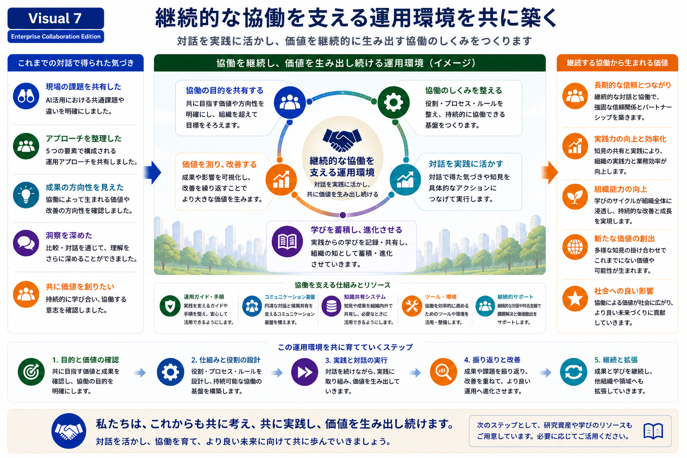

# Collaborative Operational Environment

## 継続的な協働を支える運用環境

継続的な比較対話から生まれた共有知を、実際の価値へと結び付けるためには、協働を支える運用環境が重要になります。

本Research Programでは、対話そのものだけでなく、対話から得られた知見を実践へ活かし、継続的に改善しながら価値を生み出す運用環境を重視しています。

---

*Figure 8. 比較対話を継続的な協働へ発展させる運用環境。*

---

# 協働を支える運用環境

継続的な協働では、単に意見交換を続けるだけでは十分ではありません。

本Research Programでは、

- 協働の目的を共有する
- 協働の仕組みを整える
- 対話を実践へ活かす
- 学びを蓄積し進化させる
- 成果を評価し改善を続ける

という循環を通じて、協働環境そのものを育てていきます。

---

# 運用環境を支える仕組み

この循環を継続するために、

必要に応じて、

- 運用ガイド・手順
- コミュニケーション基盤
- 知識共有システム
- 協働ツール・運営環境
- 継続的なサポート

などを組み合わせながら、組織全体の協働を支えていきます。

これらは目的ではなく、比較対話を継続的な価値創出へつなげるための基盤として位置付けています。

---

# 比較対話の視点

本スライドでは、「私たちの運営方法」を紹介することが目的ではありません。

企業の皆様と比較しながら、

- 協働をどのように継続されているか
- 組織内で知見をどのように共有しているか
- 学びや改善をどのような仕組みで支えているか

について対話を行い、それぞれの組織に適した協働環境を共に考えていくことを目指しています。

---

## 次にご覧ください

→ **08-learning-resources.md**
