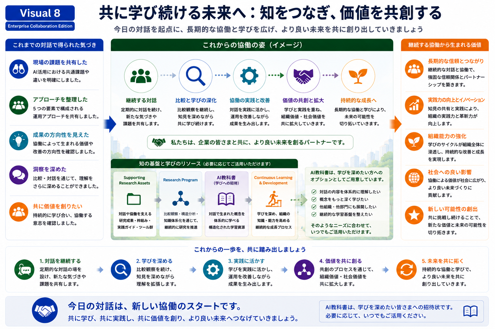

# Learning Ecosystem

## 共に学び続ける未来へ

本Research Programでは、比較対話を一度限りの情報交換ではなく、継続的な学びと価値創出の出発点として考えています。

企業との協働を通じて得られた経験や気づきを共有し、それらを知識として整理・発展させながら、より良い未来を共に創り出していくことを目指しています。

---

*Figure 9. 継続的な比較対話を支える学習エコシステムと知識基盤。*

---

# 継続的な学び

私たちは、企業との比較対話を継続しながら、

- 対話を続ける
- 学びを深める
- 実践へ活かす
- 共に価値を創る
- より良い未来へ発展させる

という循環を重視しています。

この循環を繰り返すことで、単なる情報共有ではなく、継続的な成長と価値創出を支える学習環境を形成していきます。

---

# 学びを支えるリソース

必要に応じて、

- Supporting Research Assets
- Research Program
- AI Textbook
- Continuous Learning & Development

などの学習リソースをご活用いただけます。

これらは、企業の皆様との比較対話をより深く理解し、継続的な学びへつなげるための支援基盤として位置付けています。

---

# 比較対話の視点

本スライドでは、「私たちの教材」を紹介することが目的ではありません。

企業の皆様と比較しながら、

- 学びをどのように組織へ広げているか
- 実践知をどのように継続的な知識へ発展させているか
- 長期的な人材育成や組織学習をどのように支えているか

について意見交換を行い、より良い学習環境を共に育てていくことを目指しています。

---

# 学びへの招待

AI Textbookは、対話を通じて生まれた概念や方法論を体系的に学びたい方へ向けた学習リソースです。

ご関心や目的に応じて活用いただきながら、継続的な比較対話と学びをさらに深めていただければ幸いです。

---

## 次にご覧ください

→ **[09-visual-language-design](09-visual-language-design.md)**
