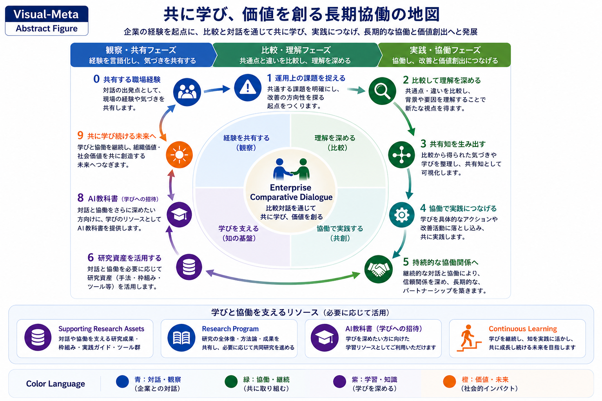

# Meta Visual

まず図全体をご覧ください。

この図は、企業と研究者が継続的な比較対話を通じて共に学び、価値を創造していく協働環境全体を表現したAbstract Figureです。

*Figure 1. Meta Visual（Abstract Figure）*

---

## 共に学び、価値を創る長期協働の地図

本ページでは、本Research Program全体を一枚の構造として表現した **Meta Visual（Abstract Figure）** をご紹介します。

この図は、研究成果を要約したものではありません。

企業と研究者が継続的な比較対話を通じて共に学び、理解を深め、協働し、新たな価値を創造していく協働環境全体を、一枚の構造として蒸留したAbstract Figureです。

---

# Meta Visual

（ここに Meta-Visual.png を配置）

---

# Meta Visualの考え方

本図は、長期的人間–AI協働の手順を示したものではありません。

また、一方向に研究成果を説明するための図でもありません。

本図は、

**Enterprise Comparative Dialogue（比較対話）**

を中心として形成される協働環境全体を表現しています。

比較対話を中心として、

- 観察
- 理解
- 協働
- 学習

という4つの構造領域が互いに支え合いながら、継続的なHuman–AI Collaborationを形成します。

これらは工程ではなく、協働環境を構成する基本的な構造要素です。

---

# 外周の構造

図の外周には、

比較対話を継続する中で繰り返し現れる代表的な活動を配置しています。

- 職場経験の共有
- 課題の整理
- 比較による理解
- 共有知の形成
- 協働による実践
- 継続的な協働関係
- 研究資産の活用
- AI教科書
- 継続的な学習

これらは直線的な工程ではなく、状況に応じて繰り返し循環する活動です。

---

# Supporting Resources

図の下部には、

比較対話を支える知識基盤として、

- Supporting Research Assets
- Research Program
- AI Textbook
- Continuous Learning

を配置しています。

必要に応じて研究成果や学習資源を活用しながら、継続的な協働を支援する構造となっています。

---

# Color Language

本図の色彩は、デザイン上の装飾ではありません。

それぞれが協働環境を構成する意味領域を表しています。

| 色 | 意味 |
|----|------|
| 青 | 対話・観察 |
| 緑 | 協働・継続 |
| 紫 | 学習・知識 |
| 橙 | 価値・未来 |

このColor Languageは、本Research Program全体で共通して使用されています。

---

# Meta Visualが表現するもの

Meta Visualは、

「完成したHuman–AI Collaboration」

を示す図ではありません。

企業と研究者が継続的な比較対話を通じて、

- 共に学び
- 知識を育て
- 協働し
- 社会的価値を創造していく

その協働環境全体を俯瞰するためのAbstract Figureです。

---

# 次にご覧ください

より具体的な内容につきましては、Presentationをご覧ください。

→ **presentations/**
