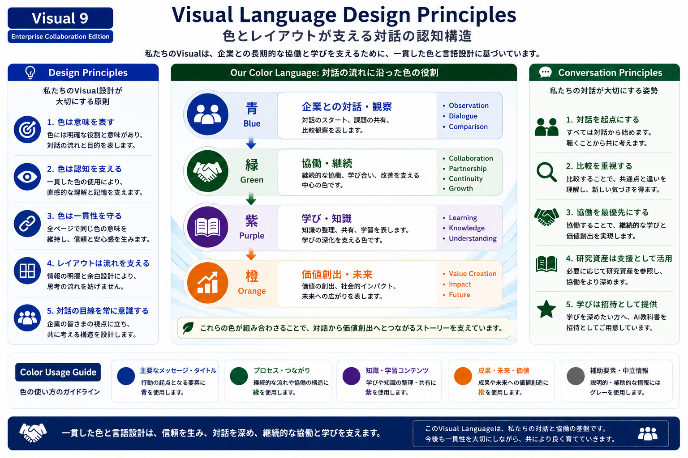

# Visual Language Design Principles

## Purpose

This document defines the visual language used throughout the Enterprise Collaboration Edition.

Rather than prescribing graphic styles, it establishes a consistent semantic relationship between colors, layout, and cognitive development.

---

## Overview

*Figure 1. Visual Language Design Principles for the Enterprise Collaboration Edition.*

---

## Color Semantics

### Blue

Dialogue

Observation

Comparison

---

### Green

Collaboration

Partnership

Continuity

---

### Purple

Learning

Knowledge

Reflection

---

### Orange

Value Creation

Impact

Future

---

## Layout Principles

...

