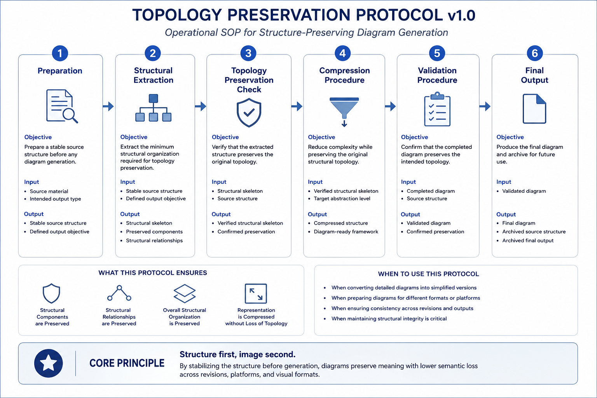

# Topology Preservation Protocol v1.0

---

## Status

Operational Protocol

Research Architecture Asset

Version: v1.0

---

## Purpose

This protocol defines the operational workflow for generating diagrams that preserve the structural topology of the original source material.

The objective is not to reproduce visual appearance.

Instead, the protocol ensures that the underlying structural organization is preserved across different levels of abstraction.

---

## Scope

This protocol is intended for diagram generation from:

- Research papers
- Research notes
- Repository architectures
- Methodological frameworks
- Presentation materials
- Medium articles
- Social media summaries
- Other structurally organized documents

---

## Preconditions

Before execution, the following conditions should be satisfied:

- The source structure has reached sufficient stability.
- The intended output type has been identified.
- The desired abstraction level has been determined.
- Structural organization is considered the primary object of preservation.

---

## Operational Workflow Overview

The overall operational workflow defined by this protocol is summarized in the following figure.



*Figure 1. Topology Preservation Protocol v1.0. The figure provides an overview of the operational workflow for generating diagrams while preserving the structural topology of the original source material across different levels of abstraction.*


---

# Phase A — Foundation

The Foundation phase establishes the operational conditions required before diagram generation begins.

Its purpose is to ensure that subsequent processing focuses on structural organization rather than visual representation.

---

# Phase B — Operational Workflow

The protocol consists of the following operational sequence:

```text
Preparation

↓

Structural Extraction

↓

Topology Preservation Check

↓

Compression Procedure

↓

Validation Procedure

↓

Final Output
```

---

## Step 1 — Preparation

### Objective

Prepare a stable source structure before any diagram generation begins.

### Input

- Source material
- Intended output type (paper, presentation, Medium article, social media, etc.)

### Procedure

1. Review the source material.
2. Confirm that the structural organization is stable.
3. Identify the intended abstraction level of the output.
4. Ignore visual layout and graphical appearance at this stage.
5. Focus only on the underlying structural organization.

### Output

- Stable source structure
- Defined output objective

---

## Step 2 — Structural Extraction

### Objective

Extract the minimum structural organization required for topology preservation.

### Input

- Stable source structure
- Defined output objective

### Procedure

1. Identify the primary structural components.
2. Identify the structural relationships between the components.
3. Separate structural elements from explanatory details.
4. Remove information not required for preserving structural organization.
5. Produce a structural skeleton representing the essential topology.

### Output

- Structural skeleton
- Preserved structural components
- Structural relationships prepared for diagram generation

---

## Step 3 — Topology Preservation Check

### Objective

Verify that the extracted structural skeleton preserves the original topology before diagram generation.

### Input

- Structural skeleton
- Source structure

### Procedure

1. Compare the structural skeleton with the source structure.
2. Confirm that all primary structural components are preserved.
3. Confirm that structural relationships remain unchanged.
4. Confirm that the overall structural organization is preserved.
5. Revise the structural skeleton if inconsistencies are identified.

### Output

- Verified structural skeleton
- Confirmed topology preservation

---

## Step 4 — Compression Procedure

### Objective

Reduce representational complexity while preserving the original structural topology.

### Input

- Verified structural skeleton
- Target abstraction level

### Procedure

1. Remove non-essential details.
2. Preserve all primary structural components.
3. Preserve all primary structural relationships.
4. Simplify labels, annotations, and visual elements as appropriate.
5. Confirm that the simplified representation expresses the same structural organization.

### Output

- Compressed structural representation
- Diagram-ready structural framework

---

## Step 5 — Validation Procedure

### Objective

Confirm that the completed diagram preserves the intended structural topology.

### Input

- Completed diagram
- Source structure

### Procedure

1. Compare the completed diagram with the original source structure.
2. Confirm that all primary structural components are represented.
3. Confirm that all primary structural relationships are preserved.
4. Confirm that structural organization remains unchanged after compression.
5. Revise the diagram if inconsistencies are identified.

### Output

- Validated diagram
- Confirmed topology preservation

---

## Step 6 — Final Output

### Objective

Produce a diagram that preserves the intended structural topology and is ready for its intended use.

### Input

- Validated diagram

### Procedure

1. Review the completed diagram.
2. Confirm that the intended abstraction level has been achieved.
3. Confirm that structural organization has been preserved.
4. Export the diagram in the required format.
5. Archive both the source structure and the final diagram for future revision if necessary.

### Output

- Final topology-preserving diagram
- Archived source structure
- Archived final output

---

# Phase C — Expected Outputs

## Expected Outputs

The protocol produces:

- A topology-preserving diagram.
- A compressed representation suitable for the intended abstraction level.
- A reusable structural framework for future diagram revisions.
- A reproducible workflow for consistent diagram generation.

---

## Validation Examples

The protocol is considered successful when:

- Primary structural components are preserved.
- Primary structural relationships are preserved.
- Overall structural organization remains unchanged.
- The diagram accurately represents the intended abstraction level.

---

## Operational Characteristics

Version 1.0 intentionally focuses on the operational workflow.

The protocol does **not** include:

- Decision Gates
- Methodological Explanations
- Design Memo
- Appendix

These elements are maintained as independent supporting documents to preserve clear role boundaries.

---

## Related Documents

- Topology Preservation Protocol Design Memo *(planned)*
- Diagram Generation Workflow
- Topology Evaluation Framework
- Structural Projection Workflow

---

## One-Line Summary

This protocol provides a reproducible operational workflow for generating diagrams that preserve the structural topology of the original source material across different levels of abstraction.
