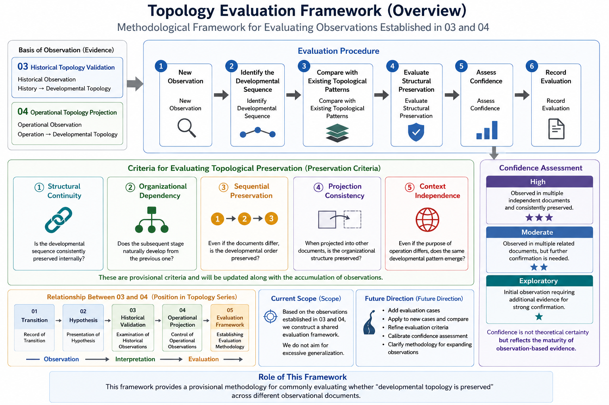

# Topology Evaluation Framework

## Status

Methodological Framework

Research Space Topology

Version: v0.1

---

## Purpose

This document provides a provisional methodological framework for evaluating whether a developmental topology is preserved across different observational contexts.

The purpose is not to introduce a new theoretical framework.

Instead, this document organizes an evaluation methodology derived from the observations recorded in the current Research Space Topology series.

---

## Working Operational Diagram

The following diagram summarizes the overall evaluation framework presented in this document.



---

## Background

---

## Background

Previous documents established that comparable developmental topology appeared across multiple observational domains.

Historical observations demonstrated repeated structural preservation during historical reconstruction.

Operational observations demonstrated repeated structural preservation during role-specific operational inquiry.

The next methodological step is to organize how such observations should be evaluated in a consistent manner.

---

## Evaluation Philosophy

Evaluation should not begin by asking whether two observations are identical.

Instead, evaluation begins by asking:

> Does the observed developmental organization preserve an equivalent topology despite differences in operational context?

Accordingly, evaluation focuses on structural preservation rather than surface similarity.

---

## Evaluation Procedure

The current evaluation workflow is provisionally organized as follows.

```text
New Observation

↓

Identify Developmental Sequence

↓

Compare with Existing Topological Patterns

↓

Evaluate Structural Preservation

↓

Assess Confidence

↓

Record Evaluation
```

This procedure is intended to support consistent evaluation across future observations.

---

## Topology Preservation Criteria

Current evaluation may consider the following provisional criteria.

### Structural Continuity

Does the developmental sequence remain internally coherent?

---

### Organizational Dependency

Do later stages emerge naturally from preceding stages?

---

### Sequential Preservation

Is the developmental ordering maintained despite contextual differences?

---

### Projection Consistency

Does the observation preserve organizational structure during projection into another context?

---

### Context Independence

Does comparable developmental organization appear despite differing operational objectives?

---

These criteria remain provisional and may evolve as additional observations accumulate.

---

## Confidence Assessment

Evaluation confidence should reflect the available observational support.

Possible assessment levels include:

### High

Repeated preservation observed across multiple independent contexts.

### Moderate

Preservation observed in several related contexts but requiring additional confirmation.

### Exploratory

Initial observation requiring further evidence before stronger interpretation.

Confidence reflects the maturity of the observational evidence rather than theoretical certainty.

---

## Relationship to Previous Documents

This framework functions as the methodological continuation of the preceding topology documents.

```text
03 Historical Topology Validation

↓

04 Operational Topology Projection

↓

05 Topology Evaluation Framework
```

Historical and operational observations provide the observational basis.

The present document provides the evaluation methodology used to assess future observations derived from those foundations.

---

## Current Scope

The current framework is derived from observations recorded within:

* Historical Topology Validation
* Operational Topology Projection

No broader methodological claims are proposed.

Future revisions should remain grounded in newly accumulated observations.

---

## Future Direction

Future refinement may include:

* additional evaluation examples
* comparative assessment across new Case observations
* refinement of preservation criteria
* calibration of confidence assessment
* methodological clarification as observational evidence expands

These directions remain provisional.

---

## Related Assets

### Research Space Topology

* Developmental Topology Invariance (Hypothesis)
* Historical Topology Validation
* Operational Topology Projection

### Dialogue Repository

* Case61–Case67

### Paper Layer

* *From Storage to Research Space: An Observational Study of Research-Space Formation*

---

## One-Line Summary

This document provides a provisional methodology for evaluating whether equivalent developmental topology is preserved across different observational contexts while remaining grounded in accumulated observations.

