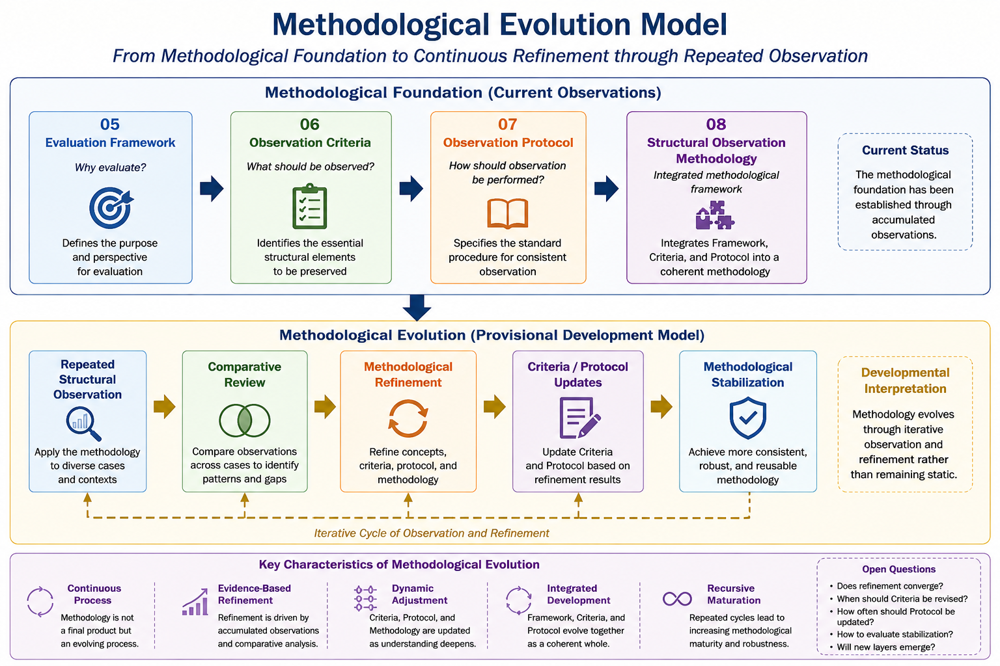

# Methodological Evolution Model (Provisinal)

## Status

Research Space Topology

Working Development Model

Version: v0.1 (Provisional)

---

## Purpose

This document records a provisional developmental model describing how the Structural Observation Methodology may evolve through repeated observation.

Its purpose is not to establish a finalized theoretical framework.

Instead, it summarizes the current interpretation derived from the accumulated methodological observations recorded within the Research Space Topology layer.

Future observations may refine, expand, or reorganize this developmental sequence.

---

## Background

Previous documents progressively established different methodological components of structural observation.

These components emerged independently before gradually forming a coherent methodological architecture.

The sequence currently observed is:

```text
05
Topology Evaluation Framework
        │
        ▼
06
Topology Preservation Observation Criteria
        │
        ▼
07
Topology Observation Protocol
        │
        ▼
08
Structural Observation Methodology
```

Together these documents describe the present methodological foundation.

---

# Current Developmental Interpretation

Current observations suggest that methodological development does not terminate once a methodology has been formulated.

Instead, repeated application of the methodology appears to generate further methodological refinement.

## Methodological Evolution Overview

The provisional developmental model discussed below is summarized in the following figure.



*Figure 1. Provisional Methodological Evolution Model illustrating how repeated structural observation may progressively refine and stabilize the Structural Observation Methodology.*


A provisional interpretation is therefore:

```text
Evaluation Framework
        │
        ▼
Observation Criteria
        │
        ▼
Observation Protocol
        │
        ▼
Structural Observation Methodology

==========================
(Current observations)
==========================

        │
        ▼

Repeated Structural Observation

        │
        ▼

Comparative Review

        │
        ▼

Methodological Refinement

        │
        ▼

Criteria / Protocol Updates

        │
        ▼

Methodological Stabilization

==========================
(Provisional Development Model)
==========================
```

---

## Interpretation

This interpretation suggests that methodology itself may gradually become an evolving observational object.

Rather than remaining static, methodological structures may be repeatedly re-examined through continued observation.

Possible refinement activities include:

- clarification of observational concepts,
- refinement of observation criteria,
- revision of observation protocols,
- reorganization of methodological architecture,
- improved structural consistency.

Accordingly, methodology is interpreted as a continuously developing component of the research program rather than a completed framework.

---

## Relationship to Related Documents

This document builds upon:

- 05 — Topology Evaluation Framework

https://github.com/ai-text-project/ai-text-project-hub/blob/main/03-research-space-topology/05-Topology-Evaluation-Framework.md

- 06 — Topology Preservation Observation Criteria

https://github.com/ai-text-project/ai-text-project-hub/blob/main/03-research-space-topology/06-Topology-Preservation-Observation-Criteria.md

- 07 — Topology Observation Protocol

https://github.com/ai-text-project/ai-text-project-hub/blob/main/03-research-space-topology/07-Topology-Observation-Protocol.md

- 08 — Structural Observation Methodology

https://github.com/ai-text-project/ai-text-project-hub/blob/main/03-research-space-topology/08-Structural-Observation-Methodology.md


Whereas the preceding documents describe the formation of methodological components, the present document provisionally describes how those components may continue to evolve through repeated application.

---

## Current Evidence

The current interpretation is primarily supported by observations including:

- repeated refinement of Observation Criteria,
- repositioning of Protocol within the methodological hierarchy,
- emergence of methodological architecture,
- methodological observer-position analysis,
- rectification through comparative consistency evaluation.

These observations collectively suggest that methodological development itself has become an observable phenomenon.

---

## Open Questions

Several questions remain open.

For example:

- Does methodological refinement converge toward a stable form?
- Under what conditions should Criteria be revised?
- How frequently should Protocol be updated?
- Can methodological stabilization be operationally evaluated?
- Are additional methodological layers likely to emerge?

Further observation is required before stronger conclusions can be drawn.

---

## Current Position within Research Space Topology

This document provisionally extends the current methodological sequence:

```text
Evaluation
        │
        ▼
Criteria
        │
        ▼
Protocol
        │
        ▼
Methodology
        │
        ▼
Methodological Evolution
```

The present document therefore represents a developmental interpretation rather than an endpoint.


---

Current Methodological Meta Cases suggest that
the Structural Observation Methodology established
in Document 08 may itself contain an internal
organizational structure.

Current observations provisionally indicate two
complementary developmental series.

Formation

↓

Operational Projection

──────────

Operation

↓

Comparative Review Procedure

Further observation is required before this
organizational interpretation should be regarded
as stable.

Current Methodological Meta Cases suggest that
the Structural Observation Methodology established
in Document 08 may itself contain an internal
organizational structure.

Current observations provisionally indicate two
complementary developmental series.

Formation

↓

Operational Projection

──────────

Operation

↓

Comparative Review Procedure

Further observation is required before this
organizational interpretation should be regarded
as stable.


---

## Status

Working Development Model

Provisional

Subject to refinement through continued structural observation.


---

## Related Important Documents

https://github.com/ai-text-project/dialogue-phase-reasoning/blob/main/40-research-map/03-meta-cases/11-%5BMM%5D-methodological-architecture-mapper-emergence.md

https://github.com/ai-text-project/dialogue-phase-reasoning/blob/main/40-research-map/05-research-notes/005-methodological-layer-working-map.md
