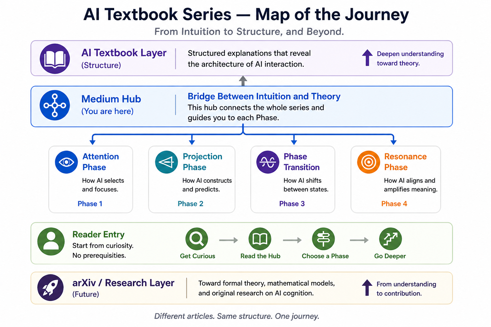

# AI Text Project Hub

A lightweight navigation hub connecting the major repositories of the AI Text Project.

This repository provides a top-level entry point for readers, researchers, and collaborators who want to understand how the project is organized across research, bridge, and public explanation layers.

---

## Project Structure

```text
Research Layer
↓
Bridge / Textbook Layer
↓
Public Medium Layer

```text
---

## Journey Map



---

Different articles. Same structure. One journey.
