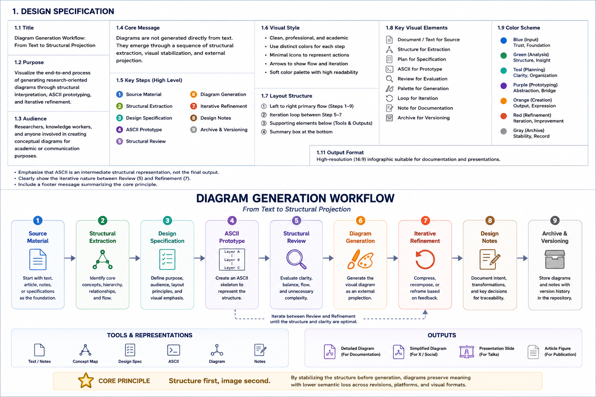

# Figures

## Purpose

This directory contains lightweight navigation figures used throughout the AI Text Project Hub.

The purpose of these figures is not detailed explanation.

Instead, they provide:

- orientation support
- repository navigation
- conceptual overview
- entry points into larger research structures

---

## Design Principles

Figures stored in this directory are intended to be:

- lightweight
- high-level
- navigation-oriented
- structurally representative

These figures function as visual gateways rather than complete theoretical descriptions.

---

## Relationship to Research Architecture

The figures in this directory support the documents located in:

- 01-research-architecture
- 00-project-topology
- 0-emergence-notes

They serve as visual companions to the architecture and evolution of the research space.

---

## Relationship to Structural Projection Workflow

For the methodology used to transform conceptual structures into visual artifacts, see:

- [Structural Projection Workflow](../01-research-architecture/06-structural-projection-workflow.md)

---

## Diagram Generation Workflow (Very Quick response) 

This figure illustrates the workflow used to transform conceptual structures into visual artifacts.

---

## Diagram Generation Workflow

This figure illustrates the workflow used to transform conceptual structures into visual artifacts.

---

## Current Figures

---

## Current Figures

### AI_Text_TOC_Simple.png

A lightweight navigation figure providing a high-level overview of the AI Text Project structure.

Its purpose is orientation rather than detailed explanation.

---

## Future Development

Additional figures may include:

- research-space evolution diagrams
- repository topology diagrams
- observation-layer diagrams
- research-program evolution diagrams

as the project continues to develop.

---

## One-Line Summary

These figures are visual navigation tools that support exploration of the research space.
